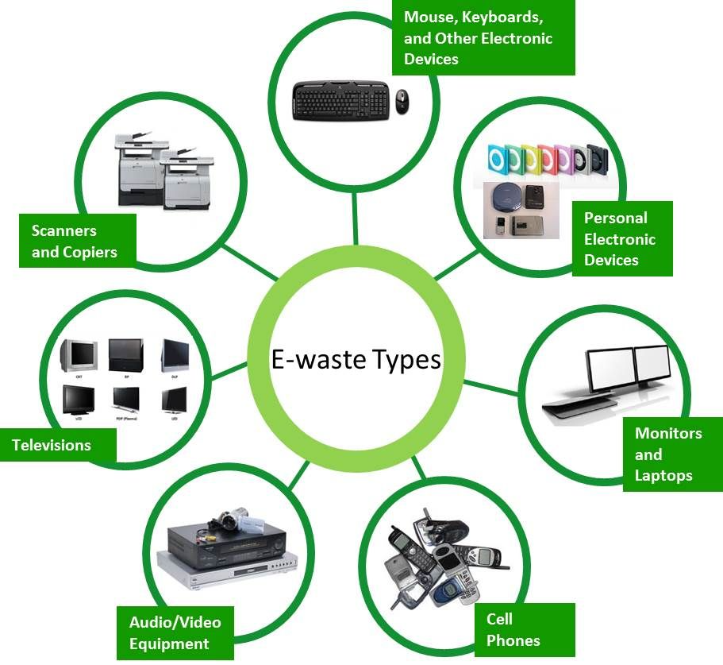
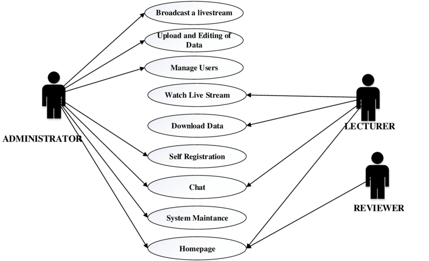

# Smart India Hackathon Workshop
# Date: 13/05/2024
## Register Number:212223220050
## Name:LATHIKA L J
## Problem Title
E-Waste Facility Locator
## Problem Description
Website that tells you the location of the nearest e-waste collection and recycling facility. Offers educational pop-ups on the harmful components of your e-waste and their effects on the environment and human health if not disposed correctly. There could be an option to input the model of your old device and earn credit points relative to the amount of precious metals recovered from the device if disposed correctly.
## Problem Creater's Organization
Ministry of Environment

## Idea

The notification system in the E-Waste Facility Locator app uses location services to alert users about nearby e-waste events and updates. It sends real-time notifications when users are close to recycling events, drives, or facilities they frequent. This system promotes user engagement, encourages participation in recycling initiatives, and builds a community around sustainable practices.

##Find Recycling Centers: The website helps you find places near you where you can recycle old electronics.

##Learn About E-Waste: It teaches you why it's important to recycle electronics instead of throwing them away because they can harm the environment and people's health.

##Earn Points: You can enter the model of your old device, and if it's recycled properly, you get points based on the valuable materials recovered.

##Easy to Use: The website is easy to use, with a map showing nearby recycling centers and information about what they accept.

##Stay Updated: It keeps you updated on the best ways to recycle and offers rewards for recycling correctly.

## Proposed Solution / Architecture Diagram

## Use Cases

## Technology Stack

Backend Framework:

Python with Django or Flask: Utilized for server-side logic, API development, and database management.

Frontend Framework:

React or Angular: Employed to create an interactive and user-friendly web-based portal for users.

Database Management:

PostgreSQL 15.4 or MySQL 5.7.43: Chosen for efficient data storage, retrieval, and management.

Geocoding API Integration:

Google Maps API: Integrated for geolocation services, displaying recycling centers, and event locations.

Security Measures:

Secure User Authentication: Implemented using industry-standard practices like JWT (JSON Web Tokens) or OAuth for secure login and access control.

Data Encryption: Utilized to encrypt sensitive user information and ensure data security.

GDPR Compliance: Ensured to adhere to data privacy regulations and protect user data.

Additional Features:

Event Management: Functionality to manage e-waste recycling events, drives, and campaigns.

Reporting and Analytics: Tools for generating reports and analyzing data related to e-waste management activities.

Notifications: Real-time notifications for users about upcoming events, updates, and important information.

User Dashboard: Personalized dashboards for users to track their recycling activities, earn rewards, and engage with the platform.

## Dependencies

The E-Waste Facility Locator relies on Python with Django or Flask for backend, PostgreSQL or MySQL for database, and integrates Google Maps API for geolocation, with JWT/OAuth for authentication and Push Notifications Service for alerts.